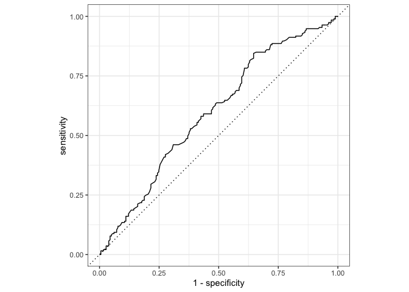
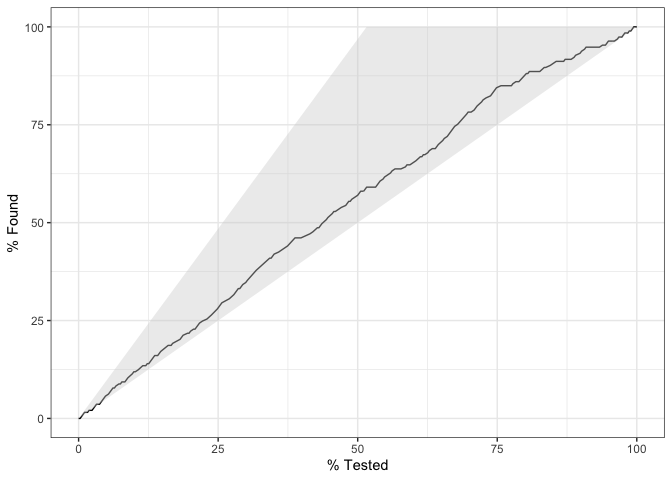
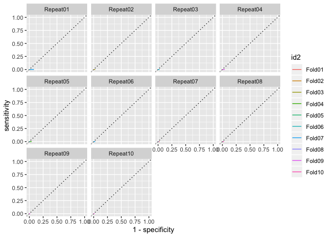
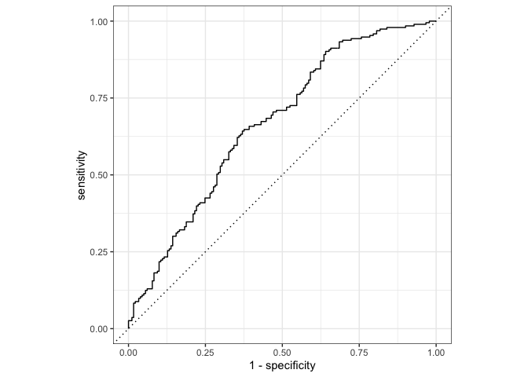
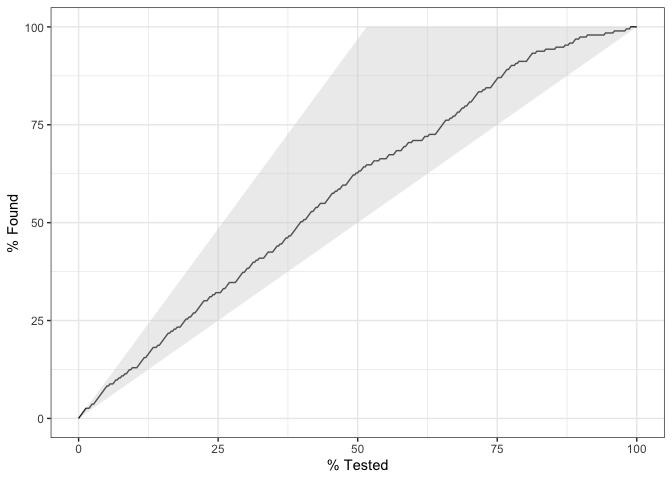
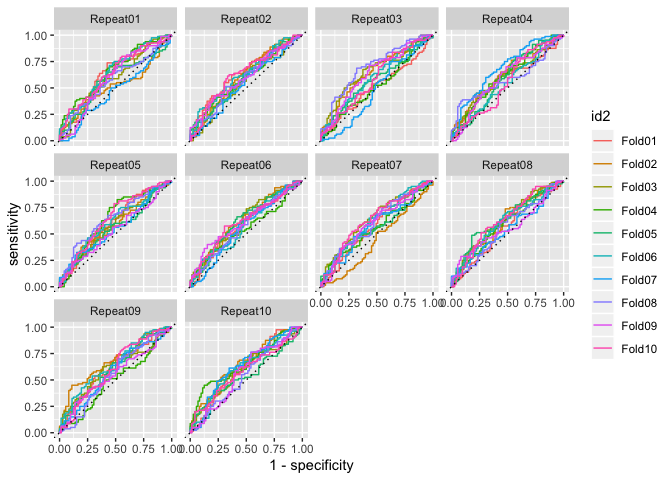
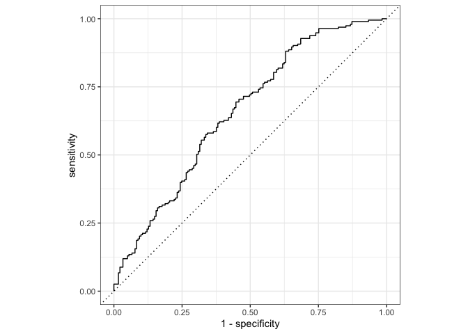
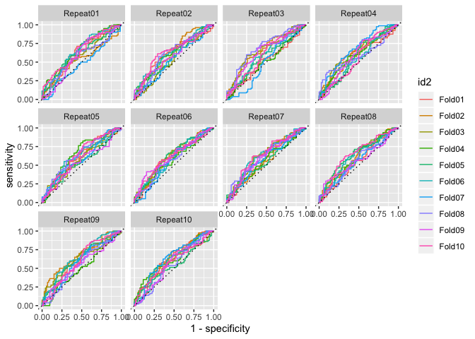

Assignment 3 - Part 2 - Diagnosing schizophrenia from voice
-----------------------------------------------------------

In the previous part of the assignment you generated a bunch of
“features”, that is, of quantitative descriptors of voice in
schizophrenia. We then looked at whether we could replicate results from
the previous literature. We now want to know whether we can
automatically diagnose schizophrenia from voice only, that is, relying
on the set of features you produced last time, we will try to produce an
automated classifier. Again, remember that the dataset containst 7
studies and 3 languages. Feel free to only include Danish (Study 1-4) if
you feel that adds too much complexity.

Issues to be discussed your report: - Should you run the analysis on all
languages/studies at the same time? - Choose your best acoustic feature
from part 1. How well can you diagnose schizophrenia just using it? -
Identify the best combination of acoustic features to diagnose
schizophrenia using logistic regression. - Discuss the “classification”
process: which methods are you using? Which confounds should you be
aware of? What are the strength and limitation of the analysis? - Bonus
question: Logistic regression is only one of many classification
algorithms. Try using others and compare performance. Some examples:
Discriminant Function, Random Forest, Support Vector Machine, etc. The
package caret provides them. - Bonus Bonus question: It is possible
combine the output of multiple classification models to improve
classification accuracy. For inspiration see,
<a href="https://machinelearningmastery.com/machine-learning-ensembles-with-r/" class="uri">https://machinelearningmastery.com/machine-learning-ensembles-with-r/</a>
The interested reader might also want to look up ‘The BigChaos Solution
to the Netflix Grand Prize’

Learning objectives
-------------------

-   Learn the basics of classification in a machine learning framework
-   Design, fit and report logistic regressions
-   Apply feature selection techniques

### Let’s start

We first want to build a logistic regression to see whether you can
diagnose schizophrenia from your best acoustic feature. Let’s use the
full dataset and calculate the different performance measures (accuracy,
sensitivity, specificity, PPV, NPV, ROC curve). You need to think
carefully as to how we should (or not) use study and subject ID.

Then cross-validate the logistic regression and re-calculate performance
on the testing folds. N.B. The cross-validation functions you already
have should be tweaked: you need to calculate these new performance
measures. Alternatively, the groupdata2 and cvms package created by
Ludvig are an easy solution.

N.B. the predict() function generates log odds (the full scale between
minus and plus infinity). Log odds &gt; 0 indicates a choice of 1, below
a choice of 0. N.N.B. you need to decide whether calculate performance
on each single test fold or save all the prediction for test folds in
one dataset, so to calculate overall performance. N.N.N.B. Now you have
two levels of structure: subject and study. Should this impact your
cross-validation? N.N.N.N.B. A more advanced solution could rely on the
tidymodels set of packages (warning: Time-consuming to learn as the
documentation is sparse, but totally worth it)

``` r
# Loading packages
library(pacman)
p_load(tidyverse, tidymodels, groupdata2)
```

Creating training and test data set
-----------------------------------

``` r
# Reading data
data <- read_csv("data_AF.csv")
```

    ## Parsed with column specification:
    ## cols(
    ##   .default = col_double(),
    ##   Language = col_character(),
    ##   Gender = col_character(),
    ##   soundname = col_character()
    ## )

    ## See spec(...) for full column specifications.

``` r
# Removing NA's
df <- filter(data, !is.na(ScaledPitchIQR))
df <- filter(df, !is.na(ScaledSpokenProp))
df <- filter(df, !is.na(ScaledSpeechRate))
df <- filter(df, !is.na(ScaledPauseDur))

#Changing Diagnosis to factor
df$Diagnosis <- as.factor(df$Diagnosis)

# Partitioning the data
set.seed(69)
df_list <- partition(df, p = 0.2, cat_col = c("Diagnosis"), id_col = c("uniquepairID"), list_out = T)
df_test = df_list[[1]]
df_train = df_list[[2]]


ls.str(df_train)
```

    ## Age :  num [1:1522] 23 23 23 23 23 23 23 23 23 23 ...
    ## articulation rate (nsyll / phonationtime) :  num [1:1522] 4.91 6.01 5.27 5.32 5.34 4.19 4.66 2.81 5.68 3.42 ...
    ## ASD (speakingtime/nsyll) :  num [1:1522] 0.204 0.166 0.19 0.188 0.187 0.239 0.215 0.356 0.176 0.292 ...
    ## Diagnosis :  Factor w/ 2 levels "0","1": 1 1 1 1 1 1 1 1 1 1 ...
    ## dur (s) :  num [1:1522] 3.6 9 6.08 9.57 12.7 ...
    ## Education :  num [1:1522] 16 16 16 16 16 16 16 16 16 16 ...
    ## Gender :  chr [1:1522] "M" "M" "M" "M" "M" "M" "M" "M" "M" "M" "F" "F" "F" "F" ...
    ## Language :  chr [1:1522] "Danish" "Danish" "Danish" "Danish" "Danish" "Danish" ...
    ## NonVerbalIQ :  num [1:1522] 105 105 105 105 105 105 105 105 105 105 ...
    ## npause :  num [1:1522] 1 4 2 5 5 2 5 0 4 2 ...
    ## nsyll :  num [1:1522] 11 20 22 29 35 15 15 4 38 5 ...
    ## Participant :  num [1:1522] 101 101 101 101 101 101 101 101 101 101 ...
    ## phonationtime (s) :  num [1:1522] 2.24 3.33 4.18 5.46 6.56 3.58 3.22 1.42 6.69 1.46 ...
    ## PitchIQR :  num [1:1522] 35.15 14.88 6.66 12.71 14.16 ...
    ## PitchMean :  num [1:1522] 133 133 122 125 131 ...
    ## PitchSD :  num [1:1522] 21.9 18.2 12.2 9.1 21.5 ...
    ## SANS :  num [1:1522] 0 0 0 0 0 0 0 0 0 0 ...
    ## SAPS :  num [1:1522] 0 0 0 0 0 0 0 0 0 0 ...
    ## ScaledPauseDur :  num [1:1522] 0.4816 0.5596 -0.0746 -0.2482 0.3025 ...
    ## ScaledPitchIQR :  num [1:1522] -0.0224 -0.3262 -0.4494 -0.3588 -0.337 ...
    ## ScaledSpeechRate :  num [1:1522] 0.0078 -1.0208 0.6935 -0.0289 -0.3596 ...
    ## ScaledSpokenProp :  num [1:1522] -0.0257 -1.6875 0.4043 -0.3663 -0.722 ...
    ## soundname :  chr [1:1522] "Study1D0S101T1" "Study1D0S101T2" "Study1D0S101T3" ...
    ## speechrate (nsyll/dur) :  num [1:1522] 3.06 2.22 3.62 3.03 2.76 2.84 2.63 1.38 3.61 2.27 ...
    ## Study :  num [1:1522] 1 1 1 1 1 1 1 1 1 1 ...
    ## TotalIQ :  num [1:1522] 102 102 102 102 102 102 102 102 102 102 ...
    ## Trial :  num [1:1522] 1 2 3 4 5 6 7 8 9 10 ...
    ## uniqueID :  num [1:1522] 1 1 1 1 1 1 1 1 1 1 ...
    ## uniquepairID :  num [1:1522] 1 1 1 1 1 1 1 1 1 1 ...
    ## VerbalIQ :  num [1:1522] 100 100 100 100 100 100 100 100 100 100 ...

Create recipe for ONLY ScaledSpeechRate as it was the feature that was described the best by Diagnosis
======================================================================================================

``` r
rec <- df_train %>% recipe(Diagnosis ~ ScaledSpeechRate + ScaledPitchIQR + ScaledPauseDur) %>% # defines the outcome
  step_center(all_numeric()) %>% # center numeric predictors
 # step_scale(all_numeric()) %>% # scales numeric predictors
  step_corr(all_numeric()) %>% 
  check_missing(everything()) %>%
  prep(training = df_train)

train_baked <- juice(rec) # extract df_train from rec

rec #inspect rec
```

    ## Data Recipe
    ## 
    ## Inputs:
    ## 
    ##       role #variables
    ##    outcome          1
    ##  predictor          3
    ## 
    ## Training data contained 1522 data points and no missing data.
    ## 
    ## Operations:
    ## 
    ## Centering for ScaledSpeechRate, ... [trained]
    ## Correlation filter removed no terms [trained]
    ## Check missing values for ScaledSpeechRate, ... [trained]

``` r
# Applying recipe to test
test_baked <- rec %>% bake(df_test)

# Seeing if our recipes are the same
juice(rec)
```

    ## # A tibble: 1,522 x 4
    ##    ScaledSpeechRate ScaledPitchIQR ScaledPauseDur Diagnosis
    ##               <dbl>          <dbl>          <dbl> <fct>    
    ##  1         -0.00296       -0.00697         0.504  0        
    ##  2         -1.03          -0.311           0.582  0        
    ##  3          0.683         -0.434          -0.0517 0        
    ##  4         -0.0397        -0.343          -0.225  0        
    ##  5         -0.370         -0.322           0.325  0        
    ##  6         -0.272         -0.200          -0.187  0        
    ##  7         -0.530          0.381          -0.668  0        
    ##  8         -2.06          -0.429           0.0228 0        
    ##  9          0.671         -0.168          -0.0382 0        
    ## 10         -0.970         -0.412          -0.838  0        
    ## # … with 1,512 more rows

``` r
rec %>% bake(df_train) # the recipes are the same, however columns are changes
```

    ## # A tibble: 1,522 x 4
    ##    Diagnosis ScaledPitchIQR ScaledSpeechRate ScaledPauseDur
    ##    <fct>              <dbl>            <dbl>          <dbl>
    ##  1 0               -0.00697         -0.00296         0.504 
    ##  2 0               -0.311           -1.03            0.582 
    ##  3 0               -0.434            0.683          -0.0517
    ##  4 0               -0.343           -0.0397         -0.225 
    ##  5 0               -0.322           -0.370           0.325 
    ##  6 0               -0.200           -0.272          -0.187 
    ##  7 0                0.381           -0.530          -0.668 
    ##  8 0               -0.429           -2.06            0.0228
    ##  9 0               -0.168            0.671          -0.0382
    ## 10 0               -0.412           -0.970          -0.838 
    ## # … with 1,512 more rows

``` r
# Creating models
# logistic regression
log_fit <- 
  logistic_reg() %>%
  set_mode("classification") %>% 
  set_engine("glm") %>%
  fit(Diagnosis ~ ScaledSpeechRate, data = train_baked)

# Applying model to test data
#predict class
log_class <- log_fit %>%
  predict(new_data = test_baked)
#get prob of class
log_prop <- log_fit %>%
  predict(new_data = test_baked, type = "prob") %>%
  pull(.pred_1)

#get multiple at once
test_results <- 
  test_baked %>% 
  select(Diagnosis) %>% 
  mutate(
    log_class = predict(log_fit, new_data = test_baked) %>% 
      pull(.pred_class),
    log_prob  = predict(log_fit, new_data = test_baked, type = "prob") %>% 
      pull(.pred_1))

test_results %>% 
  head(5) 
```

    ## # A tibble: 5 x 3
    ##   Diagnosis log_class log_prob
    ##   <fct>     <fct>        <dbl>
    ## 1 0         0            0.432
    ## 2 0         1            0.551
    ## 3 0         0            0.461
    ## 4 0         0            0.455
    ## 5 0         0            0.454

``` r
# Performance metrics including PPV, NPV, sensitivity, specificity, kappa and accuracy
#full_eval <- as_tibble(bind_rows(ppv(test_results, truth = Diagnosis, estimate = log_class), 
#           npv(test_results, truth = Diagnosis, estimate = log_class),
#            sens(test_results, truth = Diagnosis, estimate = log_class),
#            spec(test_results, truth = Diagnosis, estimate = log_class),
#            metrics(test_results, truth = Diagnosis, estimate = log_class)))

multimetric <- metric_set(accuracy, bal_accuracy, sens, yardstick::spec, ppv, npv, kap)
full_eval <- multimetric(bind_cols(test_baked, test_results), truth = Diagnosis, estimate = log_class)  
full_eval
```

    ## # A tibble: 7 x 3
    ##   .metric      .estimator .estimate
    ##   <chr>        <chr>          <dbl>
    ## 1 accuracy     binary         0.561
    ## 2 bal_accuracy binary         0.557
    ## 3 sens         binary         0.684
    ## 4 spec         binary         0.431
    ## 5 ppv          binary         0.562
    ## 6 npv          binary         0.561
    ## 7 kap          binary         0.116

``` r
# plotting the roc curve:
test_results %>%
  roc_curve(truth = Diagnosis, log_prob) %>% 
  autoplot()
```



``` r
# plotting the gain curve
test_results %>% 
  mutate(log_prob = 1 - log_prob) %>% # for the plot to show correctly (otherwise the line would be flipped)
  gain_curve(truth = Diagnosis, log_prob) %>% 
  autoplot()
```



Cross-Validation on ScaledSpeechRate
====================================

``` r
p_load(gganimate, gifski, png)
# Multiple cross validation
set.seed(69)
# create 10 folds, 10 times, and make sure Suicide_Risk is balances across groups
cv_folds <- vfold_cv(df_train, v = 10, repeats = 10, strata = Diagnosis, group = uniquepairID)

#prepare data set and fetch train data
cv_folds <- cv_folds %>% 
  mutate(recipes = splits %>%
           # prepper is a wrapper for `prep()` which handles `split` objects
           map(prepper, recipe = rec),
         train_data = splits %>% map(training))

# train model of each fold
  # create a non-fitted model
log_fit <- 
  logistic_reg() %>%
  set_mode("classification") %>% 
  set_engine("glm") 


cv_folds <- cv_folds %>%  mutate(
  log_fits = pmap(list(recipes, train_data), #input 
                            ~ fit(log_fit, formula(.x), data = bake(object = .x, new_data = .y)) # function to apply
                 ))
cv_folds %>% head(5)
```

    ## # A tibble: 5 x 6
    ##   splits          id       id2    recipes    train_data         log_fits   
    ## * <named list>    <chr>    <chr>  <named li> <named list>       <named lis>
    ## 1 <split [1.4K/1… Repeat01 Fold01 <recipe>   <tibble [1,369 × … <fit[+]>   
    ## 2 <split [1.4K/1… Repeat01 Fold02 <recipe>   <tibble [1,369 × … <fit[+]>   
    ## 3 <split [1.4K/1… Repeat01 Fold03 <recipe>   <tibble [1,370 × … <fit[+]>   
    ## 4 <split [1.4K/1… Repeat01 Fold04 <recipe>   <tibble [1,370 × … <fit[+]>   
    ## 5 <split [1.4K/1… Repeat01 Fold05 <recipe>   <tibble [1,370 × … <fit[+]>

``` r
predict_log <- function(split, rec, model) {
  # IN
    # split: a split data
    # rec: recipe to prepare the data
    # 
  # OUT
    # a tibble of the actual and predicted results
  baked_test <- bake(rec, testing(split))
  tibble(
    actual = baked_test$Diagnosis,
    predicted = predict(model, new_data = baked_test) %>% pull(.pred_class),
    prop_SCZ =  predict(model, new_data = baked_test, type = "prob") %>% pull(.pred_1),
    prop_control =  predict(model, new_data = baked_test, type = "prob") %>% pull(.pred_0)
  ) 
}

# apply our function to each split, which their respective recipes and models (in this case log fits) and save it to a new col
cv_folds <- cv_folds %>% 
  mutate(pred = pmap(list(splits, recipes, log_fits) , predict_log))

# Performance metrics
eval <- 
  cv_folds %>% 
  mutate(
    metrics = pmap(list(pred), ~ multimetric(., truth = actual, estimate = predicted, prop_SCZ))) %>% 
  select(id, id2, metrics) %>% 
  unnest(metrics)

#inspect performance metrics
multimetric2 <- metric_set(roc_auc, accuracy, bal_accuracy, sens, yardstick::spec, ppv, npv, kap)
eval %>% 
  select(repeat_n = id, fold_n = id2, metric = .metric, estimate = .estimate) %>% 
  spread(metric, estimate) %>% 
  arrange(desc(kap)) %>% 
  head()
```

    ## # A tibble: 6 x 9
    ##   repeat_n fold_n accuracy bal_accuracy   kap   npv   ppv  sens  spec
    ##   <chr>    <chr>     <dbl>        <dbl> <dbl> <dbl> <dbl> <dbl> <dbl>
    ## 1 Repeat05 Fold04    0.645        0.638 0.278 0.667 0.633 0.775 0.5  
    ## 2 Repeat01 Fold06    0.638        0.632 0.267 0.649 0.632 0.75  0.514
    ## 3 Repeat05 Fold10    0.638        0.630 0.264 0.667 0.624 0.788 0.472
    ## 4 Repeat03 Fold08    0.632        0.624 0.252 0.648 0.622 0.762 0.486
    ## 5 Repeat01 Fold01    0.627        0.622 0.246 0.643 0.619 0.75  0.493
    ## 6 Repeat01 Fold04    0.625        0.621 0.243 0.619 0.629 0.7   0.542

``` r
# Creating dataset with mean of all metrics.
evalmetrics <- eval %>% 
  select(repeat_n = id, fold_n = id2, metric = .metric, estimate = .estimate) %>% 
  spread(metric, estimate) 

mean_eval <- evalmetrics %>% summarize(
  mean(accuracy),
  mean(bal_accuracy),
  mean(kap),
  mean(npv),
  mean(ppv),
  mean(sens),
  mean(spec)
)
mean_eval %>% head()
```

    ## # A tibble: 1 x 7
    ##   `mean(accuracy)` `mean(bal_accur… `mean(kap)` `mean(npv)` `mean(ppv)`
    ##              <dbl>            <dbl>       <dbl>       <dbl>       <dbl>
    ## 1            0.574            0.567       0.136       0.566       0.579
    ## # … with 2 more variables: `mean(sens)` <dbl>, `mean(spec)` <dbl>

``` r
cv_folds %>% 
  mutate(roc = pmap(list(pred), roc_curve, truth = actual, prop_SCZ)) %>% 
  unnest(roc) %>%
  mutate(idval=as.integer(gsub("Fold", "", id2))) %>% 
  ggplot() + transition_reveal(idval) + transition_reveal(sensitivity) +
  aes(x = 1 - specificity, y = sensitivity, color = id2) +
  geom_path() +
  geom_abline(lty = 3) + facet_wrap(~id)
```



``` r
anim_save("cv.png")
```

Create recipe for ALL predictors to see if they are better at classifying
=========================================================================

``` r
rec <- df_train %>% recipe(Diagnosis ~ ScaledSpeechRate + ScaledPitchIQR + ScaledPauseDur) %>% # defines the outcome
  step_center(all_numeric()) %>% # center numeric predictors
 # step_scale(all_numeric()) %>% # scales numeric predictors
  step_corr(all_numeric()) %>% 
  check_missing(everything()) %>%
  prep(training = df_train)

train_baked <- juice(rec) # extract df_train from rec

rec #inspect rec
```

    ## Data Recipe
    ## 
    ## Inputs:
    ## 
    ##       role #variables
    ##    outcome          1
    ##  predictor          3
    ## 
    ## Training data contained 1522 data points and no missing data.
    ## 
    ## Operations:
    ## 
    ## Centering for ScaledSpeechRate, ... [trained]
    ## Correlation filter removed no terms [trained]
    ## Check missing values for ScaledSpeechRate, ... [trained]

``` r
# Applying recipe to test
test_baked <- rec %>% bake(df_test)

# Seeing if our recipes are the same
juice(rec)
```

    ## # A tibble: 1,522 x 4
    ##    ScaledSpeechRate ScaledPitchIQR ScaledPauseDur Diagnosis
    ##               <dbl>          <dbl>          <dbl> <fct>    
    ##  1         -0.00296       -0.00697         0.504  0        
    ##  2         -1.03          -0.311           0.582  0        
    ##  3          0.683         -0.434          -0.0517 0        
    ##  4         -0.0397        -0.343          -0.225  0        
    ##  5         -0.370         -0.322           0.325  0        
    ##  6         -0.272         -0.200          -0.187  0        
    ##  7         -0.530          0.381          -0.668  0        
    ##  8         -2.06          -0.429           0.0228 0        
    ##  9          0.671         -0.168          -0.0382 0        
    ## 10         -0.970         -0.412          -0.838  0        
    ## # … with 1,512 more rows

``` r
rec %>% bake(df_train) # the recipes are the same, however columns are changes
```

    ## # A tibble: 1,522 x 4
    ##    Diagnosis ScaledPitchIQR ScaledSpeechRate ScaledPauseDur
    ##    <fct>              <dbl>            <dbl>          <dbl>
    ##  1 0               -0.00697         -0.00296         0.504 
    ##  2 0               -0.311           -1.03            0.582 
    ##  3 0               -0.434            0.683          -0.0517
    ##  4 0               -0.343           -0.0397         -0.225 
    ##  5 0               -0.322           -0.370           0.325 
    ##  6 0               -0.200           -0.272          -0.187 
    ##  7 0                0.381           -0.530          -0.668 
    ##  8 0               -0.429           -2.06            0.0228
    ##  9 0               -0.168            0.671          -0.0382
    ## 10 0               -0.412           -0.970          -0.838 
    ## # … with 1,512 more rows

``` r
# Creating models
# logistic regression
log_fit <- 
  logistic_reg() %>%
  set_mode("classification") %>% 
  set_engine("glm") %>%
  fit(Diagnosis ~., data = train_baked)

# Applying model to test data
#predict class
log_class <- log_fit %>%
  predict(new_data = test_baked)
#get prob of class
log_prop <- log_fit %>%
  predict(new_data = test_baked, type = "prob") %>%
  pull(.pred_1)

#get multiple at once
test_results <- 
  test_baked %>% 
  select(Diagnosis) %>% 
  mutate(
    log_class = predict(log_fit, new_data = test_baked) %>% 
      pull(.pred_class),
    log_prob  = predict(log_fit, new_data = test_baked, type = "prob") %>% 
      pull(.pred_1))

test_results %>% 
  head(5) 
```

    ## # A tibble: 5 x 3
    ##   Diagnosis log_class log_prob
    ##   <fct>     <fct>        <dbl>
    ## 1 0         0            0.454
    ## 2 0         1            0.583
    ## 3 0         0            0.462
    ## 4 0         0            0.462
    ## 5 0         0            0.458

``` r
# Performance metrics including PPV, NPV, sensitivity, specificity, kappa and accuracy
#full_eval <- as_tibble(bind_rows(ppv(test_results, truth = Diagnosis, estimate = log_class), 
#           npv(test_results, truth = Diagnosis, estimate = log_class),
#            sens(test_results, truth = Diagnosis, estimate = log_class),
#            spec(test_results, truth = Diagnosis, estimate = log_class),
#            metrics(test_results, truth = Diagnosis, estimate = log_class)))

multimetric <- metric_set(accuracy, bal_accuracy, sens, yardstick::spec, ppv, npv, kap)
full_eval <- multimetric(bind_cols(test_baked, test_results), truth = Diagnosis, estimate = log_class)  
full_eval
```

    ## # A tibble: 7 x 3
    ##   .metric      .estimator .estimate
    ##   <chr>        <chr>          <dbl>
    ## 1 accuracy     binary         0.604
    ## 2 bal_accuracy binary         0.600
    ## 3 sens         binary         0.725
    ## 4 spec         binary         0.475
    ## 5 ppv          binary         0.596
    ## 6 npv          binary         0.619
    ## 7 kap          binary         0.202

``` r
# plotting the roc curve:
test_results %>%
  roc_curve(truth = Diagnosis, log_prob) %>% 
  autoplot()
```



``` r
# plotting the gain curve
test_results %>% 
  mutate(log_prob = 1 - log_prob) %>% # for the plot to show correctly (otherwise the line would be flipped)
  gain_curve(truth = Diagnosis, log_prob) %>% 
  autoplot()
```



Cross-Validation on ALL predictors
==================================

``` r
# Multiple cross validation
set.seed(69)
# create 10 folds, 10 times, and make sure Suicide_Risk is balances across groups
cv_folds <- vfold_cv(df_train, v = 10, repeats = 10, strata = Diagnosis, group = uniquepairID)

#prepare data set and fetch train data
cv_folds <- cv_folds %>% 
  mutate(recipes = splits %>%
           # prepper is a wrapper for `prep()` which handles `split` objects
           map(prepper, recipe = rec),
         train_data = splits %>% map(training))

# train model of each fold
  # create a non-fitted model
log_fit <- 
  logistic_reg() %>%
  set_mode("classification") %>% 
  set_engine("glm") 


cv_folds <- cv_folds %>%  mutate(
  log_fits = pmap(list(recipes, train_data), #input 
                            ~ fit(log_fit, formula(.x), data = bake(object = .x, new_data = .y)) # function to apply
                 ))
cv_folds %>% head(5)
```

    ## # A tibble: 5 x 6
    ##   splits          id       id2    recipes    train_data         log_fits   
    ## * <named list>    <chr>    <chr>  <named li> <named list>       <named lis>
    ## 1 <split [1.4K/1… Repeat01 Fold01 <recipe>   <tibble [1,369 × … <fit[+]>   
    ## 2 <split [1.4K/1… Repeat01 Fold02 <recipe>   <tibble [1,369 × … <fit[+]>   
    ## 3 <split [1.4K/1… Repeat01 Fold03 <recipe>   <tibble [1,370 × … <fit[+]>   
    ## 4 <split [1.4K/1… Repeat01 Fold04 <recipe>   <tibble [1,370 × … <fit[+]>   
    ## 5 <split [1.4K/1… Repeat01 Fold05 <recipe>   <tibble [1,370 × … <fit[+]>

``` r
predict_log <- function(split, rec, model) {
  # IN
    # split: a split data
    # rec: recipe to prepare the data
    # 
  # OUT
    # a tibble of the actual and predicted results
  baked_test <- bake(rec, testing(split))
  tibble(
    actual = baked_test$Diagnosis,
    predicted = predict(model, new_data = baked_test) %>% pull(.pred_class),
    prop_SCZ =  predict(model, new_data = baked_test, type = "prob") %>% pull(.pred_1),
    prop_control =  predict(model, new_data = baked_test, type = "prob") %>% pull(.pred_0)
  ) 
}

# apply our function to each split, which their respective recipes and models (in this case log fits) and save it to a new col
cv_folds <- cv_folds %>% 
  mutate(pred = pmap(list(splits, recipes, log_fits) , predict_log))

# Performance metrics
eval <- 
  cv_folds %>% 
  mutate(
    metrics = pmap(list(pred), ~ multimetric(., truth = actual, estimate = predicted, prop_SCZ))) %>% 
  select(id, id2, metrics) %>% 
  unnest(metrics)

#inspect performance metrics
multimetric2 <- metric_set(roc_auc, accuracy, bal_accuracy, sens, yardstick::spec, ppv, npv, kap)
eval %>% 
  select(repeat_n = id, fold_n = id2, metric = .metric, estimate = .estimate) %>% 
  spread(metric, estimate) %>% 
  arrange(desc(kap)) %>% 
  head()
```

    ## # A tibble: 6 x 9
    ##   repeat_n fold_n accuracy bal_accuracy   kap   npv   ppv  sens  spec
    ##   <chr>    <chr>     <dbl>        <dbl> <dbl> <dbl> <dbl> <dbl> <dbl>
    ## 1 Repeat05 Fold04    0.645        0.638 0.278 0.667 0.633 0.775 0.5  
    ## 2 Repeat01 Fold06    0.638        0.632 0.267 0.649 0.632 0.75  0.514
    ## 3 Repeat05 Fold10    0.638        0.630 0.264 0.667 0.624 0.788 0.472
    ## 4 Repeat03 Fold08    0.632        0.624 0.252 0.648 0.622 0.762 0.486
    ## 5 Repeat01 Fold01    0.627        0.622 0.246 0.643 0.619 0.75  0.493
    ## 6 Repeat01 Fold04    0.625        0.621 0.243 0.619 0.629 0.7   0.542

``` r
# Creating dataset with mean of all metrics.
evalmetrics <- eval %>% 
  select(repeat_n = id, fold_n = id2, metric = .metric, estimate = .estimate) %>% 
  spread(metric, estimate) 

mean_eval <- evalmetrics %>% summarize(
  mean(accuracy),
  mean(bal_accuracy),
  mean(kap),
  mean(npv),
  mean(ppv),
  mean(sens),
  mean(spec)
)
mean_eval %>% head()
```

    ## # A tibble: 1 x 7
    ##   `mean(accuracy)` `mean(bal_accur… `mean(kap)` `mean(npv)` `mean(ppv)`
    ##              <dbl>            <dbl>       <dbl>       <dbl>       <dbl>
    ## 1            0.574            0.567       0.136       0.566       0.579
    ## # … with 2 more variables: `mean(sens)` <dbl>, `mean(spec)` <dbl>

``` r
cv_folds %>% 
  mutate(roc = pmap(list(pred), roc_curve, truth = actual, prop_SCZ)) %>% 
  unnest(roc) %>% 
  ggplot() +
  aes(x = 1 - specificity, y = sensitivity, color = id2) +
  geom_path() +
  geom_abline(lty = 3) + facet_wrap(~id)
```



Running model and evaluations for ScaledSpeechRate and ScaledPitchIQR
=====================================================================

``` r
rec <- df_train %>% recipe(Diagnosis ~ ScaledSpeechRate + ScaledPitchIQR) %>% # defines the outcome
  step_center(all_numeric()) %>% # center numeric predictors
 # step_scale(all_numeric()) %>% # scales numeric predictors
  step_corr(all_numeric()) %>% 
  check_missing(everything()) %>%
  prep(training = df_train)

train_baked <- juice(rec) # extract df_train from rec

rec #inspect rec
```

    ## Data Recipe
    ## 
    ## Inputs:
    ## 
    ##       role #variables
    ##    outcome          1
    ##  predictor          2
    ## 
    ## Training data contained 1522 data points and no missing data.
    ## 
    ## Operations:
    ## 
    ## Centering for ScaledSpeechRate, ScaledPitchIQR [trained]
    ## Correlation filter removed no terms [trained]
    ## Check missing values for ScaledSpeechRate, ... [trained]

``` r
# Applying recipe to test
test_baked <- rec %>% bake(df_test)

# Seeing if our recipes are the same
juice(rec)
```

    ## # A tibble: 1,522 x 3
    ##    ScaledSpeechRate ScaledPitchIQR Diagnosis
    ##               <dbl>          <dbl> <fct>    
    ##  1         -0.00296       -0.00697 0        
    ##  2         -1.03          -0.311   0        
    ##  3          0.683         -0.434   0        
    ##  4         -0.0397        -0.343   0        
    ##  5         -0.370         -0.322   0        
    ##  6         -0.272         -0.200   0        
    ##  7         -0.530          0.381   0        
    ##  8         -2.06          -0.429   0        
    ##  9          0.671         -0.168   0        
    ## 10         -0.970         -0.412   0        
    ## # … with 1,512 more rows

``` r
rec %>% bake(df_train) # the recipes are the same, however columns are changes
```

    ## # A tibble: 1,522 x 3
    ##    Diagnosis ScaledPitchIQR ScaledSpeechRate
    ##    <fct>              <dbl>            <dbl>
    ##  1 0               -0.00697         -0.00296
    ##  2 0               -0.311           -1.03   
    ##  3 0               -0.434            0.683  
    ##  4 0               -0.343           -0.0397 
    ##  5 0               -0.322           -0.370  
    ##  6 0               -0.200           -0.272  
    ##  7 0                0.381           -0.530  
    ##  8 0               -0.429           -2.06   
    ##  9 0               -0.168            0.671  
    ## 10 0               -0.412           -0.970  
    ## # … with 1,512 more rows

``` r
# Creating models
# logistic regression
log_fit <- 
  logistic_reg() %>%
  set_mode("classification") %>% 
  set_engine("glm") %>%
  fit(Diagnosis ~ ScaledSpeechRate + ScaledPitchIQR, data = train_baked)

# Applying model to test data
#predict class
log_class <- log_fit %>%
  predict(new_data = test_baked)
#get prob of class
log_prop <- log_fit %>%
  predict(new_data = test_baked, type = "prob") %>%
  pull(.pred_1)

#get multiple at once
test_results <- 
  test_baked %>% 
  select(Diagnosis) %>% 
  mutate(
    log_class = predict(log_fit, new_data = test_baked) %>% 
      pull(.pred_class),
    log_prob  = predict(log_fit, new_data = test_baked, type = "prob") %>% 
      pull(.pred_1))

test_results %>% 
  head(5) 
```

    ## # A tibble: 5 x 3
    ##   Diagnosis log_class log_prob
    ##   <fct>     <fct>        <dbl>
    ## 1 0         0            0.455
    ## 2 0         1            0.560
    ## 3 0         0            0.480
    ## 4 0         0            0.474
    ## 5 0         0            0.476

``` r
# Performance metrics including PPV, NPV, sensitivity, specificity, kappa and accuracy
#full_eval <- as_tibble(bind_rows(ppv(test_results, truth = Diagnosis, estimate = log_class), 
#           npv(test_results, truth = Diagnosis, estimate = log_class),
#            sens(test_results, truth = Diagnosis, estimate = log_class),
#            spec(test_results, truth = Diagnosis, estimate = log_class),
#            metrics(test_results, truth = Diagnosis, estimate = log_class)))

multimetric <- metric_set(accuracy, bal_accuracy, sens, yardstick::spec, ppv, npv, kap)
full_eval <- multimetric(bind_cols(test_baked, test_results), truth = Diagnosis, estimate = log_class)  
full_eval
```

    ## # A tibble: 7 x 3
    ##   .metric      .estimator .estimate
    ##   <chr>        <chr>          <dbl>
    ## 1 accuracy     binary         0.607
    ## 2 bal_accuracy binary         0.603
    ## 3 sens         binary         0.731
    ## 4 spec         binary         0.475
    ## 5 ppv          binary         0.597
    ## 6 npv          binary         0.623
    ## 7 kap          binary         0.207

``` r
# plotting the roc curve:
test_results %>%
  roc_curve(truth = Diagnosis, log_prob) %>% 
  autoplot()
```



``` r
# plotting the gain curve
test_results %>% 
  mutate(log_prob = 1 - log_prob) %>% # for the plot to show correctly (otherwise the line would be flipped)
  gain_curve(truth = Diagnosis, log_prob) %>% 
  autoplot()
```


Cross-Validation on two predictors
==================================

``` r
# Multiple cross validation
set.seed(69)
# create 10 folds, 10 times, and make sure Suicide_Risk is balances across groups
cv_folds <- vfold_cv(df_train, v = 10, repeats = 10, strata = Diagnosis, group = uniquepairID)

#prepare data set and fetch train data
cv_folds <- cv_folds %>% 
  mutate(recipes = splits %>%
           # prepper is a wrapper for `prep()` which handles `split` objects
           map(prepper, recipe = rec),
         train_data = splits %>% map(training))

# train model of each fold
  # create a non-fitted model
log_fit <- 
  logistic_reg() %>%
  set_mode("classification") %>% 
  set_engine("glm") 


cv_folds <- cv_folds %>%  mutate(
  log_fits = pmap(list(recipes, train_data), #input 
                            ~ fit(log_fit, formula(.x), data = bake(object = .x, new_data = .y)) # function to apply
                 ))
cv_folds %>% head(5)
```

    ## # A tibble: 5 x 6
    ##   splits          id       id2    recipes    train_data         log_fits   
    ## * <named list>    <chr>    <chr>  <named li> <named list>       <named lis>
    ## 1 <split [1.4K/1… Repeat01 Fold01 <recipe>   <tibble [1,369 × … <fit[+]>   
    ## 2 <split [1.4K/1… Repeat01 Fold02 <recipe>   <tibble [1,369 × … <fit[+]>   
    ## 3 <split [1.4K/1… Repeat01 Fold03 <recipe>   <tibble [1,370 × … <fit[+]>   
    ## 4 <split [1.4K/1… Repeat01 Fold04 <recipe>   <tibble [1,370 × … <fit[+]>   
    ## 5 <split [1.4K/1… Repeat01 Fold05 <recipe>   <tibble [1,370 × … <fit[+]>

``` r
predict_log <- function(split, rec, model) {
  # IN
    # split: a split data
    # rec: recipe to prepare the data
    # 
  # OUT
    # a tibble of the actual and predicted results
  baked_test <- bake(rec, testing(split))
  tibble(
    actual = baked_test$Diagnosis,
    predicted = predict(model, new_data = baked_test) %>% pull(.pred_class),
    prop_SCZ =  predict(model, new_data = baked_test, type = "prob") %>% pull(.pred_1),
    prop_control =  predict(model, new_data = baked_test, type = "prob") %>% pull(.pred_0)
  ) 
}

# apply our function to each split, which their respective recipes and models (in this case log fits) and save it to a new col
cv_folds <- cv_folds %>% 
  mutate(pred = pmap(list(splits, recipes, log_fits) , predict_log))

# Performance metrics
eval <- 
  cv_folds %>% 
  mutate(
    metrics = pmap(list(pred), ~ multimetric(., truth = actual, estimate = predicted, prop_SCZ))) %>% 
  select(id, id2, metrics) %>% 
  unnest(metrics)

#inspect performance metrics
multimetric2 <- metric_set(roc_auc, accuracy, bal_accuracy, sens, yardstick::spec, ppv, npv, kap)
eval %>% 
  select(repeat_n = id, fold_n = id2, metric = .metric, estimate = .estimate) %>% 
  spread(metric, estimate) %>% 
  arrange(desc(kap)) %>% 
  head()
```

    ## # A tibble: 6 x 9
    ##   repeat_n fold_n accuracy bal_accuracy   kap   npv   ppv  sens  spec
    ##   <chr>    <chr>     <dbl>        <dbl> <dbl> <dbl> <dbl> <dbl> <dbl>
    ## 1 Repeat03 Fold08    0.664        0.660 0.322 0.672 0.659 0.75  0.569
    ## 2 Repeat05 Fold04    0.658        0.652 0.307 0.672 0.649 0.762 0.542
    ## 3 Repeat03 Fold09    0.638        0.633 0.268 0.644 0.634 0.738 0.528
    ## 4 Repeat03 Fold03    0.632        0.627 0.256 0.629 0.633 0.712 0.542
    ## 5 Repeat10 Fold07    0.632        0.626 0.255 0.633 0.630 0.725 0.528
    ## 6 Repeat04 Fold07    0.632        0.624 0.252 0.648 0.622 0.762 0.486

``` r
# Creating dataset with mean of all metrics.
evalmetrics <- eval %>% 
  select(repeat_n = id, fold_n = id2, metric = .metric, estimate = .estimate) %>% 
  spread(metric, estimate) 

mean_eval <- evalmetrics %>% summarize(
  mean(accuracy),
  mean(bal_accuracy),
  mean(kap),
  mean(npv),
  mean(ppv),
  mean(sens),
  mean(spec)
)
mean_eval %>% head()
```

    ## # A tibble: 1 x 7
    ##   `mean(accuracy)` `mean(bal_accur… `mean(kap)` `mean(npv)` `mean(ppv)`
    ##              <dbl>            <dbl>       <dbl>       <dbl>       <dbl>
    ## 1            0.578            0.573       0.146       0.566       0.586
    ## # … with 2 more variables: `mean(sens)` <dbl>, `mean(spec)` <dbl>

``` r
cv_folds %>% 
  mutate(roc = pmap(list(pred), roc_curve, truth = actual, prop_SCZ)) %>% 
  unnest(roc) %>% 
  ggplot() +
  aes(x = 1 - specificity, y = sensitivity, color = id2) +
  geom_path() +
  geom_abline(lty = 3) + facet_wrap(~id)
```


